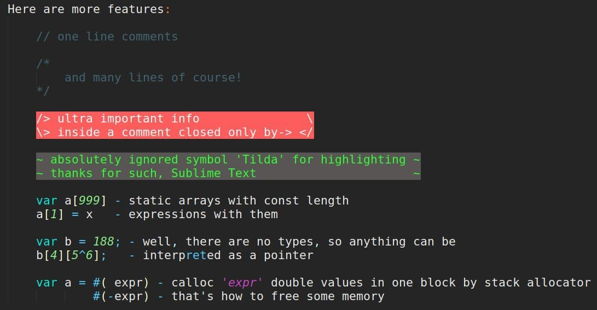

# nanoContextCompiler
This repository contents a compiler for a programming language named Context and a small tutorial on how to use it.

# ATTENTITON
The language is made as a joke in term of syntax and some over architecture decisions, so it is meant to be unmanagable to read and undestand

## Dependencies
[SoftwareProcessorUnit](https://github.com/Magorx/SPU "SPU"). Programms are compiled into assembler for this SPU.

## How to use
Just run ```make``` to compiler ```kncc``` - kNanoContextCompiler that will compile programms into assembler  
Call ```kncc input_filename``` to get default output file name or  ```kncc input_filename output_filename``` to compile input_file into asm file called as output_filename  
Let's assume we ran ```kncc prog.ctx out.kc```. So ```out.kc``` is now a file with assembler for SPU from dependencies. Let's compile it into a bytecode now (check tutorial from SPU page):  
```kasm out.kc out.tf```. ```out.tf``` is a machine code for out processor, let's run it:  
```kspu out.tf```   
Hurray, our programm is alive!

# Context language overview




